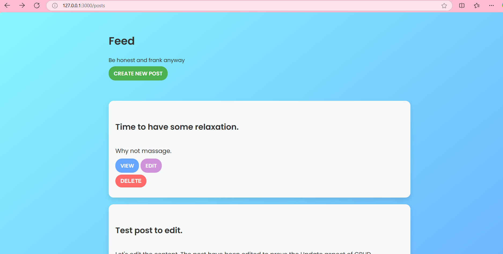

# Social Media App

A simple Ruby on Rails application demonstrating the fundamentals of **CRUD operations**, **MVC architecture**, and **responsive design**. This project showcases how to create, read, update, and delete posts in a social media-style application.

## Features
- Create, edit, and delete posts.
- Responsive design with modern CSS.
- Gradient background with consistent design elements.
- Styled buttons and forms for better user experience.

## Ruby Version
- Ruby 3.3.6

## System Dependencies
- Rails 8.0.1
- SQLite3 for the database
- Bootstrap for styling
- Propshaft for efficient asset management

## Configuration
1. Clone this repository:
   ```bash
   git clone <repository-url>
   ```
2. Navigate to the project directory:
   ```bash
   cd social_media_app
   ```
3. Install dependencies:
   ```bash
   bundle install
   yarn install
   ```

## Database Creation
Run the following commands to set up the database:
```bash
rails db:create
rails db:migrate
```

## Database Initialization
Optionally, seed the database with sample posts:
```bash
rails db:seed
```

## How to Run the App
Start the Rails server:
```bash
rails server
```
Visit the application at [http://localhost:3000](http://localhost:3000).

## How to Run the Test Suite
Tests are not included in the initial version of the project. Future updates will cover this.

## Screenshots
### Home Page


### New Post


## Services
- N/A in this version.

## Deployment Instructions
1. Precompile assets for production:
   ```bash
   rails assets:precompile
   ```
2. Use any deployment platform compatible with Rails (e.g., Heroku, AWS).

## Technologies Used
- **Ruby on Rails**: Backend framework.
- **SQLite3**: Lightweight database for development.
- **Bootstrap**: CSS framework for responsive design.
- **Stimulus.js**: For handling interactivity (e.g., delete confirmation).

## Future Enhancements
- Add user authentication (e.g., Devise gem).
- Implement file uploads for post images.
- Enhance testing with RSpec.
- Add pagination for posts.

## License
This project is open-source and available under the MIT License.
